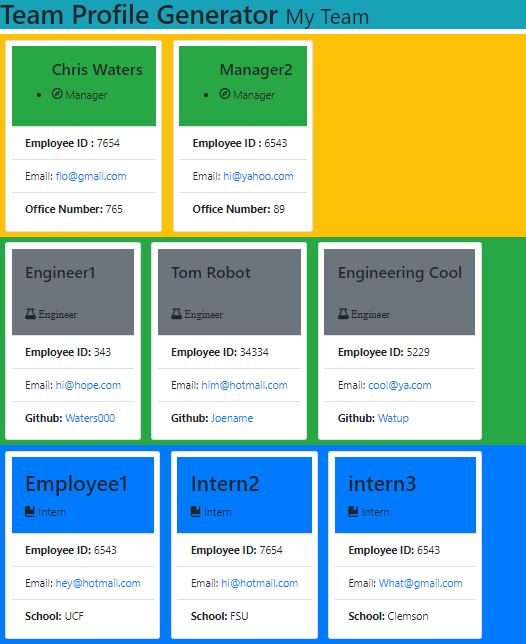

 # Title of Project
  README.md Generator    
 
        
            
## Table of Contents
1. [Description](#Description)
2. [Installation](#Installation)
3. [Usage](#Usage)
4. [Licenses](#Licenses)
5. [Contributing](#Contributing)
6. [Tests](#Tests)
7. [Built With:](#Built-with)
8. [Questions](#Questions)
9. [Year Built](#Year-built)

## Description: 
Fastest way to add a profession README to any project.  Save time by answering a list of questions that will by styled and displayed in a nice professional README.md 

## Installation
Use npm i
## Usage:
 Use this project with any GitHub project that needs a README file to speed up your documenting process.  
## Contributing: 
Chris Waters, send an email to address below to contribute   
## Tests:
Downloan with npm project, install fs and inquirer modules
 
## Built with:
JavaScript, Node

## Type of Licenses 
## License
Public License - Free for all and open to use with anything.
         

    
 ## Questions
  Floridarealty001@gmail.com - Please send me an email with additional questions or any suggestions or make this project better.
  
  "https://github.com/Waters000"

  
 

### Year Built
2022 by Waters000  